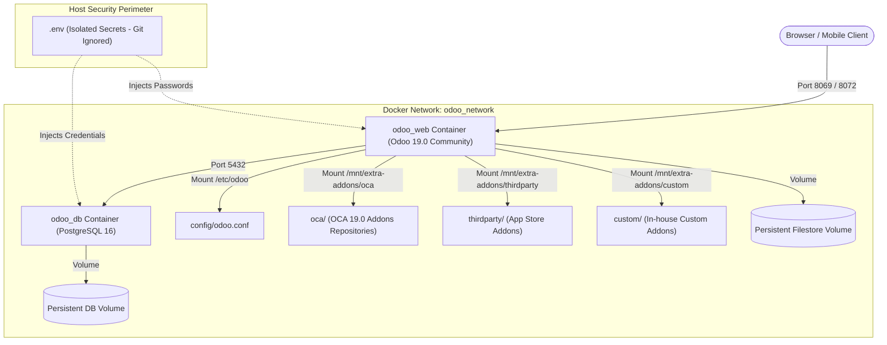

# 🚀 Odoo 19.0 Community Edition + OCA Enterprise Stack (Docker)

<div align="center">

[](https://www.odoo.com)
[](#-repository-analytics--system-metrics)
[](https://www.docker.com)
[](https://www.postgresql.org)
[](https://rsnarsna.github.io/odoo/)

<br>

[](https://buymeacoffee.com/narayanansw)
[](https://github.com/sponsors/rsnarsna)
[](https://www.gnu.org/licenses/lgpl-3.0)

<p align="center">
  <b>A turnkey, containerized ERP architecture powered by Odoo 19.0 Community and battle-tested Odoo Community Association (OCA) suites. Replace expensive Enterprise subscriptions (Accounting, Helpdesk, Subscriptions, Documents, Field Service, Quality Control, VoIP & e-Sign) with 100% open-source software and $0 recurring user license fees.</b>
</p>

[**🌐 View Interactive Documentation & Analytics Website (GitHub Pages)**](https://rsnarsna.github.io/odoo/)

</div>

---

## 📑 Table of Contents
1. [📊 Repository Analytics & System Metrics](#-repository-analytics--system-metrics)
2. [🏗️ Architecture & Technology Stack](#️-architecture--technology-stack)
3. [🎯 5-Stage Implementation Roadmap](#-5-stage-implementation-roadmap)
4. [💰 Feature & Cost Comparison vs. Odoo Enterprise](#-feature--cost-comparison-vs-odoo-enterprise)
5. [📂 Directory Tree](#-directory-tree)
6. [🔒 Security & Credential Isolation](#-security--credential-isolation)
7. [⚡ Quick Start & Deployment Guide](#-quick-start--deployment-guide)
8. [☕ Sponsor & Support the Project](#-sponsor--support-the-project)
9. [🤝 Contributing & Community Guidelines](#-contributing--community-guidelines)

---

## 📊 Repository Analytics & System Metrics

| Metric | Measured Value | Details / Verification |
|---|:---:|---|
| **Odoo Core Engine** | **19.0-20260305** | Official Docker upstream image |
| **Database Engine** | **PostgreSQL 16** | Containerized with persistent storage & health check |
| **Total Active Modules** | **214 Modules** | Verified active in PostgreSQL `ir_module_module` |
| **Deployed Stages** | **4 of 5 (100% ERP)** | Core, Finance/HR, Marketing/Sign, Operations/VoIP |
| **User License Cost** | **$0.00 / month** | Completely free and open-source licenses |
| **Estimated Cost Savings** | **~$6,000 / year** | Based on a standard 25-user Enterprise deployment |
| **Deployment Time** | **< 3 minutes** | Single-command Docker Compose orchestration |
| **Web Endpoint Response** | **HTTP 200 OK** | Verified responsive on `http://localhost:8069` |

---

## 🏗️ Architecture & Technology Stack



---

## 🎯 5-Stage Implementation Roadmap

### ✅ Stage 1: Core Operations & Essential Business Apps
* **Status:** `100% Deployed & Live` (18 Modules)
* **Core Apps:** CRM (`crm`), Sales (`sale_management`), Purchase (`purchase`), Inventory (`stock`), Invoicing (`account`), Contacts (`contacts`), Discuss/Mail (`mail`), Calendar (`calendar`), Project To-Do (`project_todo`), Website & eCommerce (`website`, `website_sale`), Projects (`project`).
* **OCA Enterprise Replacements:**
  * **Helpdesk:** OCA `helpdesk_mgmt` (Tickets, stages, teams, SLAs) — *Replaces Odoo Enterprise Helpdesk*.
  * **Subscriptions:** OCA `contract` (Recurring billing and automated renewal invoices) — *Replaces Odoo Enterprise Subscriptions*.
  * **Document Management:** OCA `dms` (File directories, metadata, access control) — *Replaces Odoo Enterprise Documents*.
  * **Barcode Scanning:** OCA `stock_barcodes`, `barcodes` — *Replaces Odoo Enterprise Barcode*.
  * **Shipping & Delivery:** OCA `delivery_carrier_info`, `delivery` (Carrier labels & tracking).

---

### ✅ Stage 2: Finance, Dynamic Accounting Reports & HR Suite
* **Status:** `100% Deployed & Live` (14 Modules)
* **OCA Accounting & Payroll Replacements:**
  * **Dynamic Financial Reports:** OCA `account_financial_report` (Drill-down General Ledger, Trial Balance, Aged Partner Balances) — *Replaces Odoo Enterprise Accounting Reports*.
  * **Excel Engine:** OCA `report_xlsx` (Native XLSX report exports).
  * **Fiscal Periods:** OCA `date_range` (Custom fiscal years and accounting periods).
  * **Payroll:** OCA `payroll` (Salary structures, rules, deductions, and payslips) — *Replaces Odoo Enterprise Payroll*.
* **Community HR Suite:**
  * Employees (`hr`), Attendance & Kiosk (`hr_attendance`), Time Off / Leaves (`hr_holidays`), Expenses (`hr_expense`), Recruitment Pipeline (`hr_recruitment`), Fleet Management (`fleet`), Maintenance (`maintenance`).

---

### ✅ Stage 3: Marketing, Customer Engagement & e-Signatures
* **Status:** `100% Deployed & Live` (12 Modules)
* **Digital Signatures:** OCA `sign_oca` (PDF signature placement, portal signing workflows) — *Replaces Odoo Enterprise Sign*.
* **Marketing Campaigns:** Email Marketing (`mass_mailing`), SMS Campaigns (`mass_mailing_sms`).
* **Customer Interaction:** Real-time Live Chat (`im_livechat`, `website_livechat`), Surveys & Quizzes (`survey`, OCA `partner_survey`), Event Organization (`event`, OCA `partner_event`), eLearning Courses (`website_slides`).
* **Communications:** OCA `crm_phonecall` (Call logging & follow-ups), `mute_notification_user_autosubscribe`.

---

### ✅ Stage 4: Advanced Operations, Manufacturing, Quality & VoIP
* **Status:** `100% Deployed & Live` (12 Modules)
* **Field Service Suite:** OCA `fieldservice` (`fieldservice`, `base_territory`, `fieldservice_crm`, `fieldservice_project`, `fieldservice_vehicle`, `fieldservice_size`) — *Replaces Odoo Enterprise Field Service*.
* **Manufacturing & Repairs:** MRP Core (`mrp`), Subcontracting (`mrp_subcontracting`), Repair Orders (`repair`).
* **Quality Control:** OCA `quality_control_oca` (Inspection points, test criteria, quality triggers) — *Replaces Odoo Enterprise Quality*.
* **PLM / BoM Tracking:** OCA `mrp_bom_tracking` (Audit trail of BoM revisions in chatter) — *Replaces Odoo Enterprise PLM*.
* **Telephony & VoIP:** OCA `voip_oca` (In-browser softphone, PBX connection, call history) — *Replaces Odoo Enterprise VoIP*.
* **Digital APIs:** OCA `rest-framework` (FastAPI / Pydantic / REST engine for mobile apps and AI connectors).

---

### ⏳ Stage 5: Production Readiness, Security & Scaling
* **Automated Backups:** Pre-configured `pg_dump` and filestore snapshots with retention policy.
* **SSL / TLS Termination:** Ready for Nginx or Caddy reverse proxy with automatic Let's Encrypt certificates.
* **Worker Optimization:** Multiprocessing configuration formula (`workers = 2 * CPU + 1`) for high-concurrency production loads.

---

## 💰 Feature & Cost Comparison vs. Odoo Enterprise

| Capability | Odoo Enterprise (Paid) | This Open-Source Stack | Open-Source Module Used |
|---|---|---|---|
| **Per-User License Cost** | **$19.90 - $24.90 / user / mo** | **$0.00 / month** | 100% Free Forever |
| **Financial Reports (GL, Trial Balance)** | Enterprise Accounting Only | ✅ Included | `account_financial_report` (OCA) |
| **Helpdesk & Ticket SLA** | Enterprise Helpdesk App | ✅ Included | `helpdesk_mgmt` (OCA) |
| **Recurring Subscriptions** | Enterprise Subscriptions App | ✅ Included | `contract` (OCA) |
| **Document Management (DMS)** | Enterprise Documents App | ✅ Included | `dms` (OCA) |
| **Field Service Management** | Enterprise Field Service App | ✅ Included | `fieldservice` suite (OCA) |
| **Digital Signatures** | Enterprise Sign App | ✅ Included | `sign_oca` (OCA) |
| **Payroll & Payslips** | Enterprise Payroll App | ✅ Included | `payroll` (OCA) |
| **Quality Control** | Enterprise Quality App | ✅ Included | `quality_control_oca` (OCA) |
| **VoIP Telephony** | Enterprise VoIP App | ✅ Included | `voip_oca` (OCA) |
| **Barcode Scanning** | Enterprise Barcode App | ✅ Included | `stock_barcodes` (OCA) |
| **Data Ownership & Hosting** | Vendor-locked / Cloud-priced | ✅ 100% Self-Hosted | Self-hosted Docker / Postgres |

---

## 📂 Directory Tree

```text
odoo/
├── .github/
│   ├── FUNDING.yml               # GitHub Sponsors & Buy Me A Coffee configuration
│   └── workflows/
│       └── pages.yml             # Automatic GitHub Pages CI/CD workflow
├── docs/
│   └── index.html                # Interactive GitHub Pages documentation & analytics portal
├── config/
│   └── odoo.conf                 # Multi-addons path configuration, database binding & settings
├── oca/                          # Cloned OCA 19.0 modules
│   ├── account-financial-reporting/
│   ├── account-financial-tools/
│   ├── connector-telephony/      # voip_oca
│   ├── contract/                 # contract (subscriptions)
│   ├── crm/                      # crm_phonecall
│   ├── delivery-carrier/         # delivery_carrier_info
│   ├── dms/                      # dms (document management)
│   ├── event/                    # partner_event
│   ├── field-service/            # fieldservice, base_territory, fieldservice_crm, etc.
│   ├── helpdesk/                 # helpdesk_mgmt
│   ├── manufacture/              # quality_control_oca, mrp_bom_tracking
│   ├── payroll/                  # payroll
│   ├── reporting-engine/         # report_xlsx
│   ├── rest-framework/           # fastapi, base_rest
│   ├── server-tools/
│   ├── server-ux/                # date_range
│   ├── sign/                     # sign_oca
│   ├── social/                   # mute_notification_user_autosubscribe
│   ├── stock-logistics-barcode/  # stock_barcodes
│   └── survey/                   # partner_survey
├── thirdparty/                   # Mount point for App Store add-ons
├── custom/                       # Mount point for in-house custom modules
├── scripts/                      # Deployment and maintenance scripts
├── .env.example                  # Template environment variables (safe for public git)
├── .env                          # Real secrets (excluded by .gitignore)
├── .gitignore                    # Security exclusion rules
├── docker-compose.yml            # Multi-container orchestration (Odoo 19 + PostgreSQL 16)
├── CONTRIBUTING.md               # Guidelines for open-source contributors
├── CODE_OF_CONDUCT.md            # Contributor Covenant Code of Conduct
└── README.md                     # Master analytics and architecture documentation
```

---

## 🔒 Security & Credential Isolation

This repository follows strict cloud-native security practices:
1. **Zero Secret Leaks:** Real credentials (`POSTGRES_PASSWORD`, `ODOO_ADMIN_PASSWORD`) are kept exclusively in local `.env`.
2. **Git Ignored Secrets:** The `.env` file is permanently ignored in `.gitignore`. Only `.env.example` with placeholder strings is tracked in version control.
3. **Database Pre-Binding:** Configured in `odoo.conf` (`db_name = odoo`) to ensure users land directly on the secure login screen without exposing the database selector.

---

## ⚡ Quick Start & Deployment Guide

### Prerequisites
- [Docker Desktop](https://www.docker.com/) (Windows / macOS) or Docker Engine + Docker Compose v2 (Linux).

### Step 1: Clone the Repository
```bash
git clone https://github.com/rsnarsna/odoo.git
cd odoo
```

### Step 2: Configure Environment Variables
```bash
# Windows PowerShell:
Copy-Item .env.example .env

# Linux / macOS:
cp .env.example .env
```
*(Optional: Open `.env` and set your preferred master password and database credentials)*

### Step 3: Launch the Stack
```bash
docker compose up -d
```

### Step 4: Access Odoo
Open your browser and navigate to:
```text
http://localhost:8069
```
* **Default Login:** `admin`
* **Default Password:** `admin`

---

## ☕ Sponsor & Support the Project

This open-source architecture saves businesses thousands of dollars every year in ERP licensing fees. If this stack has helped your business or saved you development time, please consider supporting the project:

<div align="center">

<a href="https://buymeacoffee.com/narayanansw" target="_blank" rel="noopener noreferrer">
  
</a>
&nbsp;&nbsp;&nbsp;&nbsp;
<a href="https://github.com/sponsors/rsnarsna" target="_blank" rel="noopener noreferrer">
  
</a>

<br><br>

Your sponsorship helps maintain compatibility with upcoming Odoo releases, test new OCA modules, and produce automated deployment recipes!

</div>

---

## 🌐 GitHub Pages Setup & Troubleshooting Guide

If visiting `https://rsnarsna.github.io/odoo/` shows a 404 or fails to load, follow these steps to activate it:

### Why GitHub Pages Might Not Be Active
1. **GitHub Pages is not enabled by default** on newly created repositories. You must select a deployment source in repository settings.
2. **Jekyll Processing Interference:** Traditional GitHub Pages tries to parse Markdown using Jekyll, which fails on static single-page apps. This repository includes `.nojekyll` in `/docs` to disable Jekyll and serve the responsive HTML portal instantly.

### How to Activate in 2 Clicks:
1. Open your repository on GitHub and navigate to:
   👉 **Settings** > **Pages** (or visit `https://github.com/rsnarsna/odoo/settings/pages`)
2. Under **Build and deployment > Source**, choose one of the two options:
   * **Option A (Recommended - Instant):**
     * Select **Deploy from a branch**
     * Branch: `main`
     * Folder: `/docs`
     * Click **Save**
   * **Option B (GitHub Actions):**
     * Select **GitHub Actions**
     * GitHub will automatically trigger the included workflow at `.github/workflows/pages.yml`.
3. Within 60 seconds, your portal is live at:
   **`https://rsnarsna.github.io/odoo/`**

---

## 📈 Enterprise Log Monitoring & Analytics with Splunk

For enterprise teams running **Splunk** (e.g., `splunk/universalforwarder`):
1. **Docker Logging Driver:** Configure Docker daemon or `docker-compose.yml` to forward Odoo web and database stdout/stderr to Splunk HTTP Event Collector (HEC):
   ```yaml
   logging:
     driver: "splunk"
     options:
       splunk-token: "YOUR_SPLUNK_HEC_TOKEN"
       splunk-url: "https://your-splunk-instance:8088"
       splunk-insecureskipverify: "true"
       tag: "{{.Name}}/{{.ID}}"
   ```
2. **Log File Collection:** Alternatively, configure `odoo.conf` with `logfile = /var/log/odoo/odoo.log` and mount a volume monitored by the Splunk Universal Forwarder to index slow queries, authentication logs, and worker stats.

---

## 🤝 Contributing & Community Guidelines

Contributions are warmly welcomed! Please read [CONTRIBUTING.md](CONTRIBUTING.md) and our [CODE_OF_CONDUCT.md](CODE_OF_CONDUCT.md) before opening a pull request or submitting an issue.

---

## 📜 License
* **Odoo Community Edition:** Licensed under **LGPL-3.0**.
* **OCA Modules:** Licensed under **LGPL-3.0** or **AGPL-3.0** (see individual module manifests).
* **Configuration & Orchestration Code:** Released under the **MIT License**.
